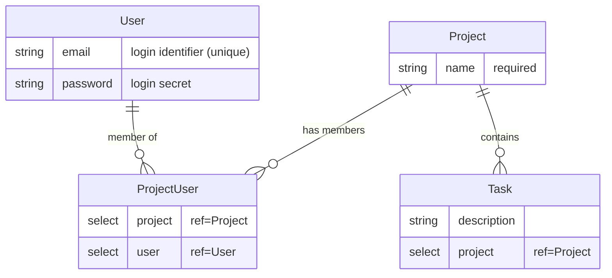
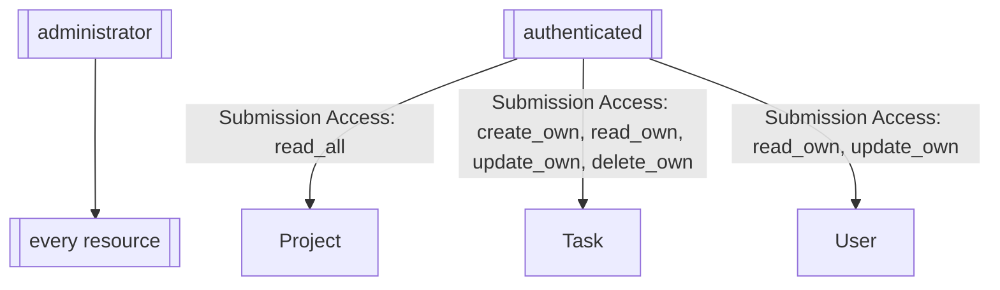

# Resource Map — Task Manager

A multi-user task manager where each Project has a set of Tasks and a team of Users, and users manage their own Tasks inside Projects.

## Resources

- Project (type: resource) Purpose: container for tasks assigned to a team of users. Fields:
  - name: textfield — human-readable project name Access: read-only for authenticated (so the task form's project select can populate); admin-managed otherwise Actions:
  - Save Submission (default)

- Task (type: resource) Purpose: a unit of work within a Project. Fields:
  - description: textfield — what needs doing
  - project: select (resource=Project, reference=true) — parent project
  Access: owner-based — authenticated users create, read, update, and delete their own Tasks Actions:
  - Save Submission (default)

- ProjectUser (type: resource, join) Purpose: many-to-many between Project and User; registers project memberships (plain membership data — no access semantics). Fields:
  - project: select (resource=Project)
  - user: select (resource=User) Access: admins only (managing membership is an admin operation) Actions:
  - Save Submission (default)

- User (type: resource) Purpose: default Form.io user resource; holds login credentials for authenticated users. Fields:
  - email: email — login identifier (unique)
  - password: password — login secret Access: admin CRUD; owner can read/update their own record Actions:
  - Save Submission (default)

## Users & Auth

- User resource: default `user`
- Login form: `userLogin` (Login action)
- Registration: self-register via `userRegister` (Save Submission → user resource, Role Assignment → `authenticated`, Login action)
- SSO: none

## Roles

- administrator: full access to all resources and memberships
- authenticated: default role on registration; owner-scoped access to Tasks, read-only Project list
- anonymous: default unauthenticated role; no submission access (can only submit login/register forms)

## Access Matrix

| Resource | Actor | create | read | update | delete | Notes |
| --- | --- | --- | --- | --- | --- | --- |
| Project | administrator | all | all | all | all | full admin |
| Project | authenticated | — | all | — | — | read-only project list — `read_all` so the task form's `project` select can populate. Project creation/editing is CE admin portal work |
| Task | administrator | all | all | all | all |  |
| Task | authenticated | own | own | own | own | owner-scoped — users manage the Tasks they created (no Group Assignment action exists in this stack) |
| ProjectUser | administrator | all | all | all | all | admin-managed membership |
| ProjectUser | authenticated | — | — | — | — | join rows are admin-created |
| User | administrator | all | all | all | all |  |
| User | authenticated | — | own | own | — | owner-level access to own record |

## ER Diagram

## Access Flow Diagram

## Companion artifact

`template.json` in this directory is the structured Form.io project-export companion to this document. Use this `.md` for architectural intent; use the `.json` for exact field shapes, component JSON, and action settings.
